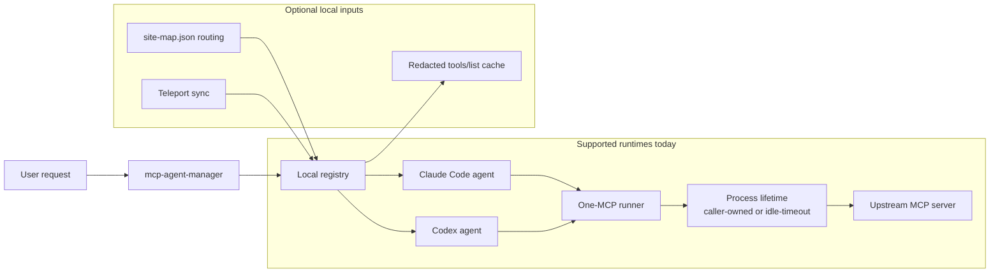

# Architecture

`mcp-agent-manager` has one job: keep parent agent context small by moving MCP work into scoped agents.

## Flow

## Process lifetime

- `run <name>` execs one MCP server and lives as long as the caller runtime keeps stdio open.
- `chat-session <name>` keeps one MCP process open until `close`, stdin closes, or idle timeout fires.
- Chat-session idle timeout defaults to `300s`.
- Override with `MCP_AGENT_MANAGER_CHAT_IDLE_TIMEOUT`, for example `900`.

## Main pieces

- `bin/mcp-agent-manager`: command entry point
- `lib/registry.sh`: bootstrap and CRUD around registry state
- `lib/renderer_claude.sh` and `lib/renderer_codex.sh`: render agent files
- `lib/runner.sh`: stdio wrapper for one MCP server
- `lib/chat_runtime.sh` and `libexec/mcp_chat_session.py`: JSONL bridge for scoped chat sessions
- `libexec/mcp_tool_cache.py` and `libexec/mcp_tools_cli.py`: redacted metadata cache
- `lib/syncer_teleport.sh`: optional Teleport catalog sync

## Local config

- `~/.config/mcp-agent-manager/site-map.json`: optional site map for OpenStack routing
- `~/.config/mcp-agent-manager/secrets.env`: local runtime secrets only

## Design rules

- Preview first
- Redact tool metadata
- Never cache `tools.call` output
- Keep generated files under managed markers
