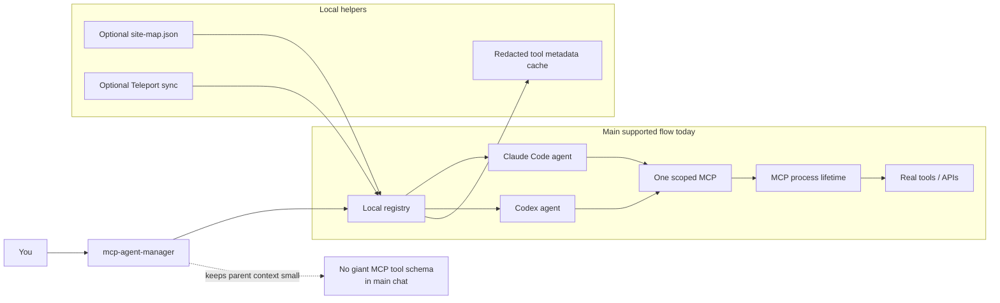

# mcp-agent-manager

[Tiếng Việt](README.vi.md)

Local-first MCP manager for Claude Code, Codex, and other agent runtimes that can use scoped agents.

It keeps MCP tools out of the main AI session. Tools are attached only to the small agent that needs them.

## What it is

- A small local CLI for managing MCP servers.
- A renderer for scoped Claude Code and Codex agents.
- A lightweight way to keep AI context smaller.
- A personal-first project you can inspect and change without running a platform.

## What it is not

- Not an enterprise MCP gateway.
- Not a Docker or Kubernetes system.
- Not a hosted service.
- Not tied to Teleport. Teleport sync is optional.

## Who it is for

- People who use many MCP servers and want less context noise.
- People who want local files, simple commands, and preview-first changes.
- People who use Claude Code, Codex, or another runtime with scoped agents/subagents.

## How it works



Main idea: Claude Code and Codex stay light. `mcp-agent-manager` picks a scoped agent, gives it one MCP, and keeps process lifetime controlled.

## MCP process lifetime

There are two runtime modes:

| Mode | How long the MCP process lives |
|---|---|
| `run <name>` | Lives as long as the caller runtime keeps it open. When the runtime stops, the MCP process stops. |
| `chat-session <name>` | Lives until `close`, stdin closes, or idle timeout is reached. Default idle timeout: `300` seconds. |

Override chat-session idle timeout:

```bash
MCP_AGENT_MANAGER_CHAT_IDLE_TIMEOUT=900 mcp-agent-manager chat-session <name>
```

## Quick start

### 0. Install requirements

macOS:

```bash
brew install git python jq zip ruby
```

Ubuntu/Debian:

```bash
sudo apt update
sudo apt install -y bash git python3 jq zip ruby
```

The one-command installer can install Ubuntu/Debian packages automatically with `apt-get`.

Teleport `tsh` is optional on both platforms. Install it only if you use `sync`.

### 1. Install

One-command install:

```bash
curl -fsSL https://raw.githubusercontent.com/<owner>/mcp-agent-manager/main/install.sh | sh
```

If you prefer to read the installer first:

```bash
curl -fsSL https://raw.githubusercontent.com/<owner>/mcp-agent-manager/main/install.sh -o install.sh
less install.sh
sh install.sh
```

Manual install:

```bash
git clone <your-fork-or-clone-url>
cd mcp-agent-manager
./bin/mcp-agent-manager doctor
./bin/mcp-agent-manager install --apply
```

After first install in an existing terminal:

```bash
source ~/.zshrc   # macOS zsh
source ~/.bashrc  # Ubuntu bash
```

### 2. Run

Preview before changing files:

```bash
./bin/mcp-agent-manager bootstrap
./bin/mcp-agent-manager render
```

Apply when preview looks right:

```bash
./bin/mcp-agent-manager bootstrap --apply
./bin/mcp-agent-manager render --apply
```

### 3. Check

```bash
./bin/mcp-agent-manager doctor
./bin/mcp-agent-manager list --all
python3 -m unittest discover -s tests -v
```

## Safe by default

- Most commands preview first.
- File changes need `--apply`.
- Generated files live under managed markers.
- Local runtime state lives under `~/.config/mcp-agent-manager/`.
- Secrets stay in `~/.config/mcp-agent-manager/secrets.env` on your machine.
- Optional site routing stays in `~/.config/mcp-agent-manager/site-map.json`.
- `curl | sh` only clones or updates this repo, then runs `install --apply`.

## Remove / Undo

To stop using generated agents:

```bash
./bin/mcp-agent-manager disable <name> --apply
./bin/mcp-agent-manager render --apply
```

To remove one personal MCP entry:

```bash
./bin/mcp-agent-manager remove <name> --apply
```

To remove installed links manually:

```bash
rm -f ~/.local/bin/mcp-agent-manager
rm -f ~/.claude/skills/mcp-agent-manager
rm -f ~/.agents/skills/mcp-agent-manager
rm -f ~/.codex/skills/mcp-agent-manager
```

This does not remove your local config at `~/.config/mcp-agent-manager/`.

## Optional site map

Site routing is optional. If you need it, start from:

```text
examples/site-map.example.json
```

Put your private copy here:

```text
~/.config/mcp-agent-manager/site-map.json
```

Do not commit real company hostnames, site names, tokens, or credentials.

## Features

### Supported now

| Feature | Status |
|---|---|
| Local MCP registry | Supported |
| Preview-first commands | Supported |
| Claude Code agent rendering | Supported |
| Codex agent rendering | Supported |
| Scoped one-MCP runner | Supported |
| Redacted `tools/list` metadata cache | Supported |
| Claude Chat JSONL bridge | Supported |
| Configurable chat-session idle timeout | Supported |
| Optional site map routing | Supported |
| Optional Teleport catalog sync | Supported |
| Quarantine unhealthy Teleport MCP entries | Supported |
| Fresh `HOME` portability tests | Supported |

### Supported command helpers

| Helper | What it does |
|---|---|
| `doctor` | Checks local dependencies, writable agent dirs, and installed skill links. |
| `install` | Creates local CLI, skill links, shell PATH entry, config dir, and Desktop Chat ZIP. |
| `bootstrap` | Imports existing Claude/Codex MCP globals into the local registry. |
| `list` | Shows MCP names, status, target runtime, and descriptions. |
| `render` | Generates scoped Claude Code and Codex agents. |
| `apply` | Runs the full preview-first cutover flow. |
| `enable`, `disable`, `remove` | Manage personal MCP registry entries. |
| `run` | Runtime helper used by generated agents to start one scoped MCP. |
| `chat-session` | Runtime helper for JSONL chat sessions with idle timeout. |
| `tools list/search/refresh/index` | Inspect and refresh redacted `tools/list` metadata cache. |
| `sync` | Optional Teleport catalog sync helper. |

### Not supported yet

| Feature | Status |
|---|---|
| `add`, `edit` commands | Planned, not implemented |
| Web UI | Not planned for first public version |
| Docker/Kubernetes deployment | Not planned for first public version |
| Hosted/remote control plane | Not planned |
| Multi-user governance | Not planned |
| Windows support | Not tested |
| Hermes/OpenClaw rendering | Planned direction, not implemented |
| Automatic GitHub release workflow | Not included yet |
| Plugin marketplace/catalog UI | Not included yet |

## Advanced commands

```bash
./bin/mcp-agent-manager doctor
./bin/mcp-agent-manager list [--all]
./bin/mcp-agent-manager bootstrap [--apply]
./bin/mcp-agent-manager sync [--target all|claude|codex] [--apply]
./bin/mcp-agent-manager enable <name> [--apply]
./bin/mcp-agent-manager disable <name> [--apply]
./bin/mcp-agent-manager remove <name> [--apply]
./bin/mcp-agent-manager render [--apply]
./bin/mcp-agent-manager apply [--apply] [--allow-smoke-warn]
./bin/mcp-agent-manager run <name>
./bin/mcp-agent-manager chat-session <name>
./bin/mcp-agent-manager tools list [<name>] [--all]
./bin/mcp-agent-manager tools search <query> [--name <name>] [--limit N] [--all]
./bin/mcp-agent-manager tools refresh <name>|--all [--apply]
./bin/mcp-agent-manager install [--apply]
```

`sync --apply` is for optional Teleport-managed entries. It runs a read-only health gate. Unhealthy entries are quarantined and disabled.

`tools` manages redacted `tools/list` metadata under `~/.config/mcp-agent-manager/tool-cache/`. Tool outputs are never cached.

## More docs

- `ARCHITECTURE.md` - short system map
- `CODEMAP.md` - where the main code lives
- `AGENTS.md` - rules for AI/code agents working in this repo
- `SECURITY.md` - what must stay private
