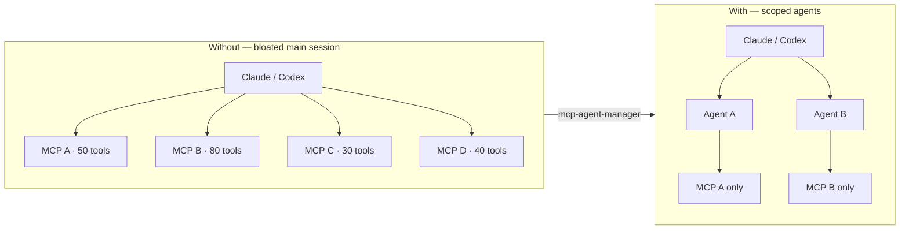

# mcp-agent-manager

[](LICENSE)
[](#quick-start)
[](#quick-start)

> **Keep your AI context small. Give each agent exactly one MCP.**

[Tiếng Việt](README.vi.md)

---

## Contents

- [The problem](#the-problem)
- [The fix](#the-fix)
- [What it does](#what-it-does)
- [Quick start](#quick-start)
- [Demo](#demo)
- [Runtime modes](#runtime-modes)
- [Day-to-day commands](#day-to-day-commands)
- [Safety model](#safety-model)
- [Supported features](#supported-features)
- [Undo](#undo)
- [Contributing](#contributing)
- [More docs](#more-docs)

---

## The problem

Every MCP server you add dumps its full tool list into your AI session. Ten servers × fifty tools = hundreds of schema lines crowding the context window before you even ask a question.

```
Main session  →  MCP A (50 tools)
              →  MCP B (80 tools)
              →  MCP C (30 tools)   ← all loaded, all the time
              →  MCP D (40 tools)
```

## The fix

`mcp-agent-manager` renders a tiny scoped agent for each MCP. The main session stays clean. Tools load only when the right agent is called.



---

## What it does

- Imports your existing MCP globals from `~/.claude.json` and `~/.codex/config.toml`
- Renders scoped agent files for Claude Code and Codex
- Manages process lifetime for STDIO and HTTP-transport MCPs
- Caches redacted `tools/list` metadata so the AI can search without connecting
- Optional Teleport catalog sync with automatic quarantine

## What it is not

- Not an enterprise gateway or hosted service
- Not Docker or Kubernetes
- Not tied to Teleport — sync is optional

---

## Quick start

### Requirements

**macOS**
```bash
brew install git python jq zip
```

**Ubuntu / Debian**
```bash
sudo apt update && sudo apt install -y bash git python3 jq zip
```

### Install

One command:
```bash
curl -fsSL https://raw.githubusercontent.com/lkhung09/mcp-agent-manager/main/install.sh | sh
```

Prefer to read first:
```bash
curl -fsSL https://raw.githubusercontent.com/lkhung09/mcp-agent-manager/main/install.sh -o install.sh
less install.sh
sh install.sh
```

Manual:
```bash
git clone https://github.com/lkhung09/mcp-agent-manager.git
cd mcp-agent-manager
./bin/mcp-agent-manager install --apply
```

Then reload your shell:
```bash
source ~/.zshrc    # macOS zsh
source ~/.bashrc   # Linux bash
```

### First run

Every command previews before it changes anything. Add `--apply` when the preview looks right.

```bash
# 1. Check your environment
mcp-agent-manager doctor

# 2. Import existing MCP entries
mcp-agent-manager bootstrap          # preview
mcp-agent-manager bootstrap --apply  # write

# 3. Render scoped agents
mcp-agent-manager render             # preview
mcp-agent-manager render --apply     # write

# 4. Full cutover (backup → render → validate → smoke → cutover)
mcp-agent-manager apply              # preview
mcp-agent-manager apply --apply      # execute
```

---

## Demo

```
$ mcp-agent-manager doctor
[doctor] ✓ jq /path/to/jq
[doctor] ✓ claude /path/to/claude
[doctor] ✓ codex /path/to/codex
[doctor] ✓ ~/.claude/agents writable
[doctor] ✓ ~/.codex/agents writable

$ mcp-agent-manager list
SLUG                                          ENABLED  STATUS       TARGET   DESCRIPTION
----                                          -------  ------       ------   -----------
filesystem                                    true     active       all      Use for filesystem MCP operations.
notebooklm                                    true     active       claude   Use for notebooklm MCP operations.
openai                                        true     active       codex    Use for openai MCP operations.
teleport-han02                                false    disabled     all      Use for authorized Teleport MCP operations.

$ mcp-agent-manager tools search "read file"
SCORE NAME                                          CACHE    TOOL                                   DESCRIPTION
----- ----                                          -----    ----                                   -----------
9     filesystem                                    fresh    read_file                              Read the complete contents of a file...
6     filesystem                                    fresh    read_multiple_files                    Read multiple files simultaneously...
```

---

## Runtime modes

| Command | MCP process lifetime |
|---|---|
| `run <mcp-name>` | Lives as long as the calling agent keeps it open |
| `session <mcp-name>` | Lives until `close`, stdin closes, or idle timeout (default 300s) |

Override idle timeout:
```bash
MCP_AGENT_MANAGER_CHAT_IDLE_TIMEOUT=900 mcp-agent-manager session <mcp-name>
```

---

## Day-to-day commands

```bash
mcp-agent-manager list [--all]                          # show registry
mcp-agent-manager enable  <name> [--apply]              # enable one MCP
mcp-agent-manager disable <name> [--apply]              # disable one MCP
mcp-agent-manager remove  <name> [--apply]              # remove one MCP

mcp-agent-manager tools list                            # list cached tool metadata
mcp-agent-manager tools search <query>                  # search tool descriptions
mcp-agent-manager tools refresh <name> --apply          # refresh one entry
mcp-agent-manager tools refresh --all  --apply          # refresh all

mcp-agent-manager sync [--target all|claude|codex] [--apply]   # Teleport sync
```

---

## Safety model

| Behavior | Default |
|---|---|
| Commands preview before writing | Always |
| File writes require `--apply` | Always |
| Generated files carry managed markers | Always |
| Secrets stay in `~/.config/mcp-agent-manager/secrets.env` | Mode 0600 |
| Auto-restore backup on any step failure | During `apply --apply` |
| HTTP-transport credentials stored redacted only | Always |

---

## Supported features

| Feature | Status |
|---|---|
| Local MCP registry | Supported |
| Preview-first commands | Supported |
| Claude Code agent rendering | Supported |
| Codex agent rendering | Supported |
| Scoped one-MCP runner | Supported |
| Redacted `tools/list` metadata cache + search index | Supported |
| Claude Chat JSONL bridge | Supported |
| Configurable session idle timeout | Supported |
| Optional site map routing | Supported |
| Optional Teleport catalog sync | Supported |
| Quarantine unhealthy Teleport MCP entries | Supported |
| `add`, `edit` commands | Planned |
| Hermes / OpenClaw rendering | Planned |
| Windows support | Not tested |
| Web UI / hosted control plane | Not planned |

---

## Undo

Stop using generated agents:
```bash
mcp-agent-manager disable <name> --apply
mcp-agent-manager render --apply
```

Remove one entry:
```bash
mcp-agent-manager remove <name> --apply
```

Remove installed links:
```bash
rm -f ~/.local/bin/mcp-agent-manager
rm -f ~/.claude/skills/mcp-agent-manager
rm -f ~/.agents/skills/mcp-agent-manager
rm -f ~/.codex/skills/mcp-agent-manager
```

Local config at `~/.config/mcp-agent-manager/` is not removed automatically.

---

## Contributing

```bash
# Run tests
python3 -m unittest discover -s tests -v

# Check environment
mcp-agent-manager doctor
```

See [CONTRIBUTING.md](CONTRIBUTING.md) for guidelines and [AGENTS.md](AGENTS.md) for AI agent rules.

---

## More docs

| File | What's inside |
|---|---|
| `ARCHITECTURE.md` | Short system map |
| `CODEMAP.md` | Where the main code lives |
| `AGENTS.md` | Rules for AI agents working in this repo |
| `SECURITY.md` | What must stay private |
| `examples/site-map.example.json` | Starting point for optional site routing |
