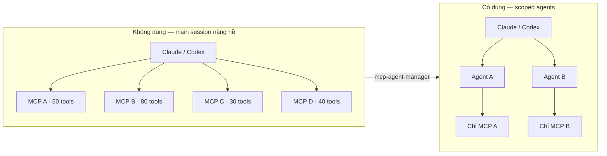

# mcp-agent-manager

[](LICENSE)
[](#bắt-đầu-nhanh)
[](#bắt-đầu-nhanh)

> **Giữ context AI luôn nhỏ gọn. Mỗi agent chỉ dùng đúng một MCP.**

[English](README.md)

---

## Mục lục

- [Vấn đề](#vấn-đề)
- [Giải pháp](#giải-pháp)
- [Làm được gì](#làm-được-gì)
- [Bắt đầu nhanh](#bắt-đầu-nhanh)
- [Demo](#demo)
- [Vòng đời MCP process](#vòng-đời-mcp-process)
- [Lệnh thường dùng](#lệnh-thường-dùng)
- [Mô hình an toàn](#mô-hình-an-toàn)
- [Tính năng](#tính-năng)
- [Gỡ cài đặt](#gỡ-cài-đặt)
- [Đóng góp](#đóng-góp)
- [Tài liệu thêm](#tài-liệu-thêm)

---

## Vấn đề

Mỗi MCP server bạn thêm vào sẽ nhét toàn bộ danh sách tool vào phiên AI. Mười server × năm mươi tool = hàng trăm dòng schema lấp đầy context window trước khi bạn kịp đặt câu hỏi.

```
Main session  →  MCP A (50 tools)
              →  MCP B (80 tools)
              →  MCP C (30 tools)   ← tất cả load cùng lúc, mọi lúc
              →  MCP D (40 tools)
```

## Giải pháp

`mcp-agent-manager` tạo một scoped agent nhỏ riêng cho từng MCP. Phiên chính luôn sạch. Tool chỉ load khi đúng agent được gọi.



---

## Làm được gì

- Import MCP globals từ `~/.claude.json` và `~/.codex/config.toml` hiện có
- Render scoped agent files cho Claude Code và Codex
- Quản lý vòng đời process cho STDIO và HTTP-transport MCPs
- Cache redacted `tools/list` metadata để AI có thể tìm kiếm mà không cần kết nối
- Tùy chọn: Teleport catalog sync với tự động quarantine

## Không phải là gì

- Không phải enterprise gateway hay hosted service
- Không phải Docker hay Kubernetes
- Không bắt buộc dùng Teleport — sync là tùy chọn

---

## Bắt đầu nhanh

### Yêu cầu

**macOS**
```bash
brew install git python jq zip
```

**Ubuntu / Debian**
```bash
sudo apt update && sudo apt install -y bash git python3 jq zip
```

### Cài đặt

Một lệnh duy nhất:
```bash
curl -fsSL https://raw.githubusercontent.com/lkhung09/mcp-agent-manager/main/install.sh | sh
```

Muốn đọc script trước:
```bash
curl -fsSL https://raw.githubusercontent.com/lkhung09/mcp-agent-manager/main/install.sh -o install.sh
less install.sh
sh install.sh
```

Cài thủ công:
```bash
git clone https://github.com/lkhung09/mcp-agent-manager.git
cd mcp-agent-manager
./bin/mcp-agent-manager install --apply
```

Sau đó reload shell:
```bash
source ~/.zshrc    # macOS zsh
source ~/.bashrc   # Linux bash
```

### Lần chạy đầu tiên

Mọi lệnh đều preview trước khi thay đổi bất cứ thứ gì. Thêm `--apply` khi preview trông đúng.

```bash
# 1. Kiểm tra môi trường
mcp-agent-manager doctor

# 2. Import MCP entries hiện có
mcp-agent-manager bootstrap          # xem preview
mcp-agent-manager bootstrap --apply  # ghi file

# 3. Render scoped agents
mcp-agent-manager render             # xem preview
mcp-agent-manager render --apply     # ghi file

# 4. Full cutover (backup → render → validate → smoke → cutover)
mcp-agent-manager apply              # xem preview
mcp-agent-manager apply --apply      # thực thi
```

---

## Demo

```
$ mcp-agent-manager doctor
[doctor] ✓ jq /path/to/jq
[doctor] ✓ claude /path/to/claude
[doctor] ✓ codex /path/to/codex
[doctor] ✓ ~/.claude/agents writable
[doctor] ✓ ~/.codex/agents writable

$ mcp-agent-manager list
SLUG                                          ENABLED  STATUS       TARGET   DESCRIPTION
----                                          -------  ------       ------   -----------
filesystem                                    true     active       all      Use for filesystem MCP operations.
notebooklm                                    true     active       claude   Use for notebooklm MCP operations.
openai                                        true     active       codex    Use for openai MCP operations.
teleport-han02                                false    disabled     all      Use for authorized Teleport MCP operations.

$ mcp-agent-manager tools search "read file"
SCORE NAME                                          CACHE    TOOL                                   DESCRIPTION
----- ----                                          -----    ----                                   -----------
9     filesystem                                    fresh    read_file                              Read the complete contents of a file...
6     filesystem                                    fresh    read_multiple_files                    Read multiple files simultaneously...
```

---

## Vòng đời MCP process

| Lệnh | Process sống bao lâu |
|---|---|
| `run <mcp-name>` | Sống theo agent gọi nó. Agent đóng thì process dừng. |
| `session <mcp-name>` | Sống đến khi `close`, stdin đóng, hoặc idle timeout (mặc định 300s) |

Đổi idle timeout:
```bash
MCP_AGENT_MANAGER_CHAT_IDLE_TIMEOUT=900 mcp-agent-manager session <mcp-name>
```

---

## Lệnh thường dùng

```bash
mcp-agent-manager list [--all]                          # xem registry
mcp-agent-manager enable  <name> [--apply]              # bật một MCP
mcp-agent-manager disable <name> [--apply]              # tắt một MCP
mcp-agent-manager remove  <name> [--apply]              # xóa một MCP

mcp-agent-manager tools list                            # xem cached tool metadata
mcp-agent-manager tools search <query>                  # tìm kiếm tool theo mô tả
mcp-agent-manager tools refresh <name> --apply          # refresh một entry
mcp-agent-manager tools refresh --all  --apply          # refresh tất cả

mcp-agent-manager sync [--target all|claude|codex] [--apply]   # Teleport sync
```

---

## Mô hình an toàn

| Hành vi | Mặc định |
|---|---|
| Lệnh preview trước khi ghi | Luôn luôn |
| Ghi file cần `--apply` | Luôn luôn |
| File sinh ra có managed markers | Luôn luôn |
| Secrets ở `~/.config/mcp-agent-manager/secrets.env` | Mode 0600 |
| Tự restore backup khi có bước thất bại | Trong `apply --apply` |
| HTTP-transport credentials chỉ lưu dạng redacted | Luôn luôn |

---

## Tính năng

| Tính năng | Trạng thái |
|---|---|
| Local MCP registry | Hỗ trợ |
| Preview-first commands | Hỗ trợ |
| Claude Code agent rendering | Hỗ trợ |
| Codex agent rendering | Hỗ trợ |
| Scoped one-MCP runner | Hỗ trợ |
| Redacted `tools/list` metadata cache + search index | Hỗ trợ |
| Claude Chat JSONL bridge | Hỗ trợ |
| Configurable session idle timeout | Hỗ trợ |
| Optional site map routing | Hỗ trợ |
| Optional Teleport catalog sync | Hỗ trợ |
| Quarantine unhealthy Teleport MCP entries | Hỗ trợ |
| Lệnh `add`, `edit` | Planned |
| Hermes / OpenClaw rendering | Planned |
| Windows support | Chưa test |
| Web UI / hosted control plane | Không có kế hoạch |

---

## Gỡ cài đặt

Ngừng dùng generated agents:
```bash
mcp-agent-manager disable <name> --apply
mcp-agent-manager render --apply
```

Xóa một entry:
```bash
mcp-agent-manager remove <name> --apply
```

Xóa installed links:
```bash
rm -f ~/.local/bin/mcp-agent-manager
rm -f ~/.claude/skills/mcp-agent-manager
rm -f ~/.agents/skills/mcp-agent-manager
rm -f ~/.codex/skills/mcp-agent-manager
```

Local config ở `~/.config/mcp-agent-manager/` không tự xóa.

---

## Đóng góp

```bash
# Chạy tests
python3 -m unittest discover -s tests -v

# Kiểm tra môi trường
mcp-agent-manager doctor
```

Xem [CONTRIBUTING.md](CONTRIBUTING.md) để biết guidelines và [AGENTS.md](AGENTS.md) cho AI agent rules.

---

## Tài liệu thêm

| File | Nội dung |
|---|---|
| `ARCHITECTURE.md` | Sơ đồ hệ thống ngắn |
| `CODEMAP.md` | Map code chính |
| `AGENTS.md` | Rules cho AI agents làm việc trong repo |
| `SECURITY.md` | Dữ liệu nào phải giữ private |
| `examples/site-map.example.json` | Điểm bắt đầu cho optional site routing |
