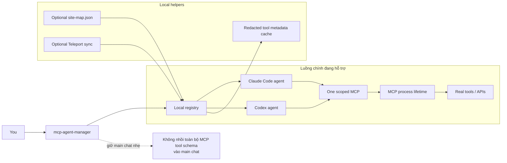

# mcp-agent-manager

[English](README.md)

Trình quản lý MCP chạy local cho Claude Code, Codex, và các agent runtime có hỗ trợ scoped agents/subagents.

Mục tiêu: giữ phiên chat AI chính nhẹ hơn. MCP tools chỉ được gắn vào helper agent nhỏ khi cần dùng.

## Đây là gì

- CLI nhỏ để quản lý MCP servers trên máy cá nhân.
- Bộ render agent riêng cho Claude Code và Codex.
- Cách nhẹ để giảm nhiễu context khi dùng nhiều MCP tools.
- Dự án personal-first, dễ đọc, dễ sửa, không cần chạy platform lớn.

## Không phải là gì

- Không phải enterprise MCP gateway.
- Không phải Docker/Kubernetes system.
- Không phải hosted service.
- Không bắt buộc dùng Teleport. Teleport sync là tùy chọn.

## Phù hợp với ai

- Người dùng nhiều MCP servers và muốn giảm context noise.
- Người thích local files, lệnh đơn giản, thay đổi có preview trước.
- Người dùng Claude Code, Codex, hoặc runtime khác có scoped agents/subagents.

## Cách hoạt động



Ý chính: Claude Code và Codex vẫn nhẹ. `mcp-agent-manager` chọn đúng scoped agent, cấp đúng một MCP, và kiểm soát vòng đời MCP process.

## MCP process sống bao lâu

Có 2 kiểu runtime:

| Mode | MCP process sống bao lâu |
|---|---|
| `run <name>` | Sống theo runtime gọi nó. Runtime đóng thì MCP process dừng. |
| `chat-session <name>` | Sống tới khi `close`, stdin đóng, hoặc idle timeout. Default idle timeout: `300` giây. |

Đổi idle timeout cho chat-session:

```bash
MCP_AGENT_MANAGER_CHAT_IDLE_TIMEOUT=900 mcp-agent-manager chat-session <name>
```

## Bắt đầu nhanh

### 0. Yêu cầu cài đặt

macOS:

```bash
brew install git python jq zip ruby
```

Ubuntu/Debian:

```bash
sudo apt update
sudo apt install -y bash git python3 jq zip ruby
```

One-command installer có thể tự cài package trên Ubuntu/Debian bằng `apt-get`.

Teleport `tsh` là tùy chọn trên cả hai nền tảng. Chỉ cần cài nếu bạn dùng `sync`.

### 1. Cài đặt

Cài bằng một lệnh:

```bash
curl -fsSL https://raw.githubusercontent.com/<owner>/mcp-agent-manager/main/install.sh | sh
```

Nếu muốn đọc script trước khi chạy:

```bash
curl -fsSL https://raw.githubusercontent.com/<owner>/mcp-agent-manager/main/install.sh -o install.sh
less install.sh
sh install.sh
```

Cài thủ công:

```bash
git clone <your-fork-or-clone-url>
cd mcp-agent-manager
./bin/mcp-agent-manager doctor
./bin/mcp-agent-manager install --apply
```

Sau lần cài đầu tiên trong terminal đang mở:

```bash
source ~/.zshrc   # macOS zsh
source ~/.bashrc  # Ubuntu bash
```

### 2. Chạy

Xem preview trước khi ghi file:

```bash
./bin/mcp-agent-manager bootstrap
./bin/mcp-agent-manager render
```

Apply khi preview đã đúng:

```bash
./bin/mcp-agent-manager bootstrap --apply
./bin/mcp-agent-manager render --apply
```

### 3. Kiểm tra

```bash
./bin/mcp-agent-manager doctor
./bin/mcp-agent-manager list --all
python3 -m unittest discover -s tests -v
```

## Mặc định an toàn

- Hầu hết command preview trước.
- Muốn ghi file phải thêm `--apply`.
- File sinh ra có managed markers.
- Runtime state nằm ở `~/.config/mcp-agent-manager/`.
- Secrets nằm ở `~/.config/mcp-agent-manager/secrets.env` trên máy bạn.
- Optional site routing nằm ở `~/.config/mcp-agent-manager/site-map.json`.
- `curl | sh` chỉ clone/update repo này, rồi chạy `install --apply`.

## Gỡ / quay lui

Ngừng dùng generated agents:

```bash
./bin/mcp-agent-manager disable <name> --apply
./bin/mcp-agent-manager render --apply
```

Xóa một personal MCP entry:

```bash
./bin/mcp-agent-manager remove <name> --apply
```

Xóa installed links thủ công:

```bash
rm -f ~/.local/bin/mcp-agent-manager
rm -f ~/.claude/skills/mcp-agent-manager
rm -f ~/.agents/skills/mcp-agent-manager
rm -f ~/.codex/skills/mcp-agent-manager
```

Lệnh này không xóa local config ở `~/.config/mcp-agent-manager/`.

## Optional site map

Site routing là tùy chọn. Nếu cần, bắt đầu từ:

```text
examples/site-map.example.json
```

Đặt bản riêng tư tại:

```text
~/.config/mcp-agent-manager/site-map.json
```

Không commit hostname công ty, site name thật, token, hoặc credentials.

## Tính năng

### Đang hỗ trợ

| Tính năng | Trạng thái |
|---|---|
| Local MCP registry | Hỗ trợ |
| Preview-first commands | Hỗ trợ |
| Claude Code agent rendering | Hỗ trợ |
| Codex agent rendering | Hỗ trợ |
| Scoped one-MCP runner | Hỗ trợ |
| Redacted `tools/list` metadata cache | Hỗ trợ |
| Claude Chat JSONL bridge | Hỗ trợ |
| Configurable chat-session idle timeout | Hỗ trợ |
| Optional site map routing | Hỗ trợ |
| Optional Teleport catalog sync | Hỗ trợ |
| Quarantine unhealthy Teleport MCP entries | Hỗ trợ |
| Fresh `HOME` portability tests | Hỗ trợ |

### Helper command đang hỗ trợ

| Helper | Dùng để làm gì |
|---|---|
| `doctor` | Kiểm tra dependency local, agent dirs có ghi được không, và skill links đã cài. |
| `install` | Tạo CLI local, skill links, shell PATH entry, config dir, và Desktop Chat ZIP. |
| `bootstrap` | Import MCP globals hiện có từ Claude/Codex vào local registry. |
| `list` | Xem MCP name, status, target runtime, và description. |
| `render` | Sinh scoped agents cho Claude Code và Codex. |
| `apply` | Chạy full cutover flow theo kiểu preview trước. |
| `enable`, `disable`, `remove` | Quản lý personal MCP registry entries. |
| `run` | Runtime helper cho generated agents để start đúng một scoped MCP. |
| `chat-session` | Runtime helper cho JSONL chat sessions có idle timeout. |
| `tools list/search/refresh/index` | Xem và refresh redacted `tools/list` metadata cache. |
| `sync` | Optional helper để sync Teleport catalog. |

### Chưa hỗ trợ

| Tính năng | Trạng thái |
|---|---|
| `add`, `edit` commands | Planned, chưa implement |
| Web UI | Chưa planned cho public version đầu |
| Docker/Kubernetes deployment | Chưa planned cho public version đầu |
| Hosted/remote control plane | Chưa planned |
| Multi-user governance | Chưa planned |
| Windows support | Chưa test |
| Hermes/OpenClaw rendering | Hướng mở rộng, chưa implement |
| Automatic GitHub release workflow | Chưa có |
| Plugin marketplace/catalog UI | Chưa có |

## Advanced commands

```bash
./bin/mcp-agent-manager doctor
./bin/mcp-agent-manager list [--all]
./bin/mcp-agent-manager bootstrap [--apply]
./bin/mcp-agent-manager sync [--target all|claude|codex] [--apply]
./bin/mcp-agent-manager enable <name> [--apply]
./bin/mcp-agent-manager disable <name> [--apply]
./bin/mcp-agent-manager remove <name> [--apply]
./bin/mcp-agent-manager render [--apply]
./bin/mcp-agent-manager apply [--apply] [--allow-smoke-warn]
./bin/mcp-agent-manager run <name>
./bin/mcp-agent-manager chat-session <name>
./bin/mcp-agent-manager tools list [<name>] [--all]
./bin/mcp-agent-manager tools search <query> [--name <name>] [--limit N] [--all]
./bin/mcp-agent-manager tools refresh <name>|--all [--apply]
./bin/mcp-agent-manager install [--apply]
```

`sync --apply` dùng cho Teleport-managed entries tùy chọn. Nó chạy read-only health gate. Entry không khỏe sẽ bị quarantine và disable.

`tools` quản lý redacted `tools/list` metadata ở `~/.config/mcp-agent-manager/tool-cache/`. Tool outputs không bao giờ được cache.

## Tài liệu thêm

- `ARCHITECTURE.md` - sơ đồ hệ thống ngắn
- `CODEMAP.md` - map code chính
- `AGENTS.md` - rules cho AI/code agents làm việc trong repo
- `SECURITY.md` - dữ liệu nào phải giữ private
